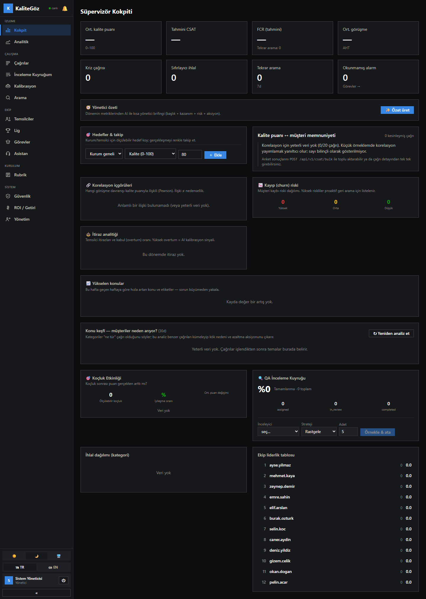
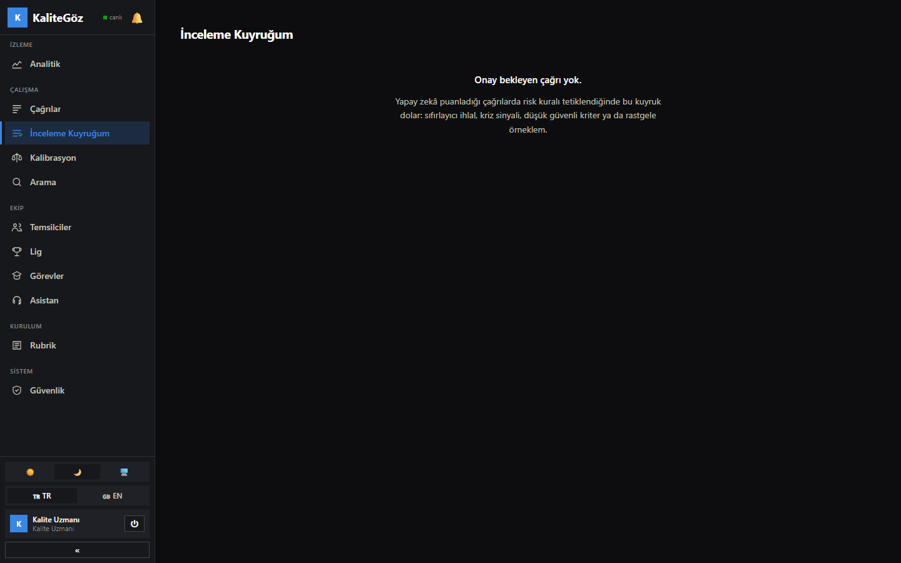
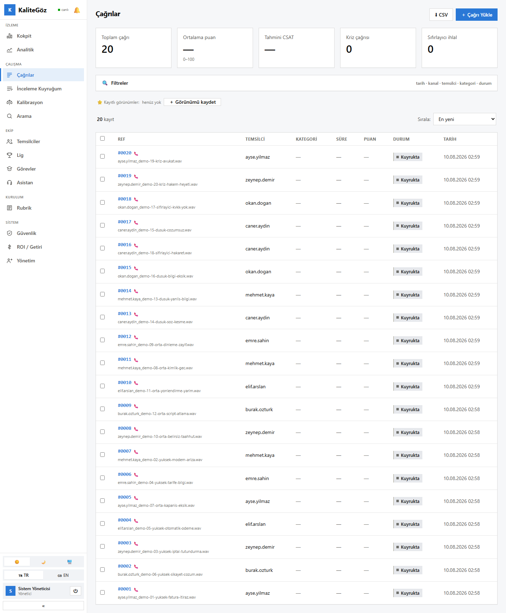
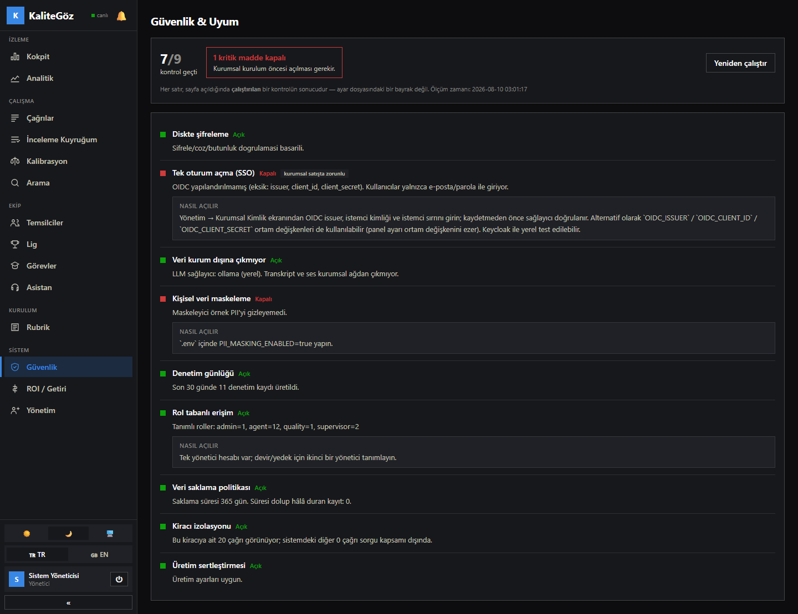

# KaliteGöz

**Çağrı merkezi görüşmelerini otomatik puanlayan, kararının kanıtını gösteren
ve kendi sınırını bilen bir kalite yönetim platformu.** Tamamen yerel çalışır —
ses, transkript ve puanlar kurumun donanımından hiç çıkmaz.

<sub>Türkçe ana doküman · [English summary below](#english-summary)</sub>

---

## Neden var?

Çağrı merkezlerinde kalite kontrolü elle yapılır ve çağrıların **%2-5'ini**
kapsar. Kalan %95+ hiç denetlenmez: uyum ihlali, yanlış bilgi ve müşteri kaybı
sinyalleri görülmeden geçer.

KaliteGöz her çağrıyı puanlar, **her kararın yanına transkriptten birebir
alıntı koyar**, ve güvenilir olmadığını bildiği kriteri insana yollar.

---

## Ekranlar

### Süpervizör kokpiti


### İnceleme kuyruğu — kanıtla birlikte puanlama


### Çağrı listesi


### Güvenlik ve uyum durumu


---

## Ölçülen doğruluk

50 senaryoluk altın set üzerinde, gerçek puanlama motoruyla. `make eval` ile
**yeniden üretilebilir**; ham çıktılar [`docs/eval/`](docs/eval/) altında.

| Metrik | v1 | v2 |
|---|---|---|
| Sıfırlayıcı ihlal yanlış-pozitif | %38.5 | **%0.0** |
| Sıfırlayıcı ihlal yanlış-negatif | %18.2 | **%0.0** |
| Kriter bazlı ortalama hata (MAE, 0-10) | 2.16 | **0.78** |
| Kanıt doğrulanabilirlik | %56.1 | **%100** |
| Tekrarlanabilirlik (3 koşum, std) | 1.95 | **0.46** |
| Tam isabet oranı | %21.4 | **%64.9** |

### Kriter türüne göre — çünkü tek ortalama yanıltıyor

| | Nesnel kriterler | Öznel kriterler |
|---|---|---|
| Ne ölçer | Açılış, KVKK anonsu, kimlik doğrulama, kapanış, üslup | Aktif dinleme, ihtiyaç analizi, çözüm, bilgi doğruluğu |
| Nasıl çözülür | **Kodla** — dil modeline sorulmaz | Kanıt zorunlu LLM |
| Cohen's kappa | Çekirdek 4 kriter: **0.94–1.00** | **0.18** |
| Kapsam iddiası | %100, puan kesin | **Öneri** — geçerli puan insan onayıyla oluşur |

> **Bu tablo ürünün en dürüst kısmıdır.** Öznel kriterlerde sistem güvenilir
> değil ve **bunu biliyor**: kappa'sı 0.40'ın altındaki kriterlerde güven
> skoru otomatik tavanlanır, çağrı garantili insan onayına düşer.
>
> Referans setinin nasıl üretildiği ve neyin *kanıtlanmadığı*:
> [KALITE-METODOLOJISI.md §4](docs/KALITE-METODOLOJISI.md)

---

## Nasıl çalışır — üç katman

```
KATMAN A — DETERMİNİSTİK ÖN KONTROL   (kod, LLM yok)
   ↓ kesin cevabı olan her şey burada biter ve LLM'i EZER
KATMAN B — KANIT ZORUNLU LLM          (kriter grubu bazında, sıcaklık 0)
   ↓ her kararın yanında transkriptten birebir alıntı
KATMAN C — SUNUCU DOĞRULAMASI          (kod)
   ↓ alıntı gerçekten transkriptte var mı? puan aritmetiği KODDA
```

**Üç mutlak kural**

1. **Kanıt yoksa ceza yok.** Doğrulanamayan alıntıyla düşük puan verilmez;
   kriter "yetersiz kanıt" olur ve insana gider.
2. **Toplam puan kodda hesaplanır.** Dil modeline toplam sordurulmaz.
3. **Kanıtsız sıfırlama sistem hatasıdır** ve istisna fırlatır.

Ayrıntı: [MIMARI.md](docs/MIMARI.md)

---

## Özellikler

**Puanlama ve uyum**
Üç katmanlı hibrit motor · sıfırlayıcı ihlal tespiti · yasaklı kelime ve üslup ·
kriz tespiti (avukat/hakem heyeti) · KVKK anonsu denetimi · script uyumu ·
kanıt–ses bağı (alıntıya tıkla, o saniyeyi dinle)

**İki aşamalı kalite kontrol**
Risk bazlı inceleme kuyruğu (7 kural) · kaliteci onayı/düzeltme · temsilci
itirazı · kalibrasyon oturumları ve değerlendiriciler arası uyum · koçluk
planı ve koçluk etkisi ölçümü · temsilci öz değerlendirmesi

**Analitik**
Süpervizör kokpiti · konu keşfi ve kök neden kümeleme · trend/anomali alarmı ·
müşteri kaybı (churn) riski · gerçek FCR · **kalite puanı ↔ gerçek CSAT
korelasyonu** · ROI hesabı · hedef takibi · lig ve rozetler

**Kurumsal**
Çok kiracılı · 4 rol + takım kapsamı · OIDC/SSO (panelden yapılandırılır) ·
diskte şifreleme + anahtar rotasyonu + KMS yolu · PII maskeleme · denetim
günlüğü · saklama süresi otomasyonu · webhook + açık API · TR/EN arayüz ·
açık/koyu tema

Rakiplerle karşılaştırma ve **neyimiz yok**: [PIYASA-ANALIZI.md](docs/PIYASA-ANALIZI.md)

---

## 5 dakikada kurulum

**Gereksinimler:** Docker Desktop, [Ollama](https://ollama.com) (host'ta),
16 GB RAM (32 GB önerilir).

```bash
git clone <depo-adresi> && cd KaliteGoz

# 1) Sırları üret — elle doldurulacak TEK alan kalmaz
./scripts/generate-secrets.sh

# 2) Yapay zekâ modelleri — Ollama HOST'ta çalışır, Docker'da DEĞİL
ollama pull qwen2.5:7b-instruct
ollama pull nomic-embed-text

# 3) Servisler
docker compose up -d --build

# 4) Doğrula
curl http://localhost:8000/health    # {"status":"ok"}
curl http://localhost:8000/ready     # {"status":"ready"}
```

Panel: **http://localhost:3000** · API: **http://localhost:8000/docs**

Sistemi adım adım denemek için: [TEST-REHBERI.md](docs/TEST-REHBERI.md)
Donanım, üretim sertleştirmesi, sorun giderme: [KURULUM.md](docs/KURULUM.md)

---

## Teknoloji

| Katman | Ne |
|---|---|
| Backend | Python 3.12 · FastAPI · SQLAlchemy 2 · Celery |
| Veri | PostgreSQL 16 · Redis 7 |
| Frontend | Next.js 15 (App Router) · React 19 · TypeScript · Tailwind |
| Yapay zekâ | **Ollama** (yerel LLM + gömme) · **Whisper** (STT) — host'ta çalışır |
| Dağıtım | Docker Compose · on-prem |

---

## Geliştirme

```bash
make test      # backend regresyon takimi
make eval      # altin set uzerinde puanlama dogrulugu (esik saglanmazsa CI kirilir)
make audit     # Turkce karakter + arayuz (keskin kose, tanimli renk) denetimi
```

Kod ve doküman rehberi: [CLAUDE.md](CLAUDE.md) · Tüm dokümanlar: [docs/](docs/README.md)

---

## Lisans

[AGPL-3.0](LICENSE) — Ayrıntı ve gerekçe: [docs/FINAL-RAPOR.md](docs/FINAL-RAPOR.md)

---

<a name="english-summary"></a>

## English summary

**KaliteGöz** is a call-center quality management platform that scores every
conversation, **shows the verbatim transcript evidence behind each decision**,
and knows where it is unreliable. It runs **fully on-premise** — audio,
transcripts and scores never leave your hardware.

**Three-layer scoring.** Layer A resolves objective compliance criteria
(greeting, GDPR/KVKK notice, identity verification, closing, banned language)
**in code** — the LLM is never asked. Layer B evaluates subjective criteria
with an LLM that must quote the transcript. Layer C **verifies every quote
server-side**; an unverifiable quote yields no score and routes the call to a
human reviewer.

**Measured, reproducible accuracy** (50-scenario golden set, `make eval`):

| Metric | v1 | v2 |
|---|---|---|
| Zeroing-violation false positives | 38.5% | **0.0%** |
| Mean absolute error (0-10 scale) | 2.16 | **0.78** |
| Evidence verifiability | 56.1% | **100%** |
| Repeatability (3 runs, std dev) | 1.95 | **0.46** |

Cohen's kappa is **0.94–1.00** on the four core objective criteria and
**0.18** on subjective ones. We publish both numbers: on subjective criteria
the system produces a *suggestion*, and a valid score requires human approval.
See [docs/KALITE-METODOLOJISI.md](docs/KALITE-METODOLOJISI.md) for how the
reference set was produced and what is explicitly **not** proven.

Interface language: Turkish and English. Documentation: Turkish.
